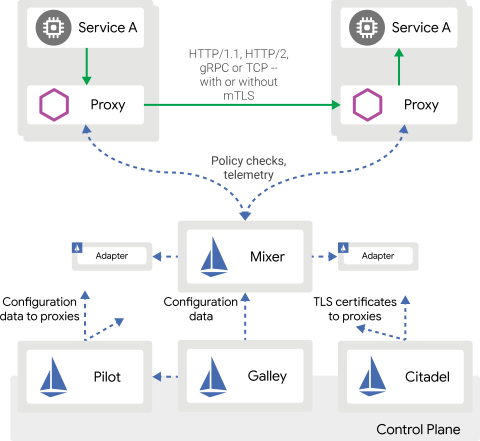

## Overview

This document contains information specific to how containers work in an Istio cluster.

- [Istio Architecture Page](https://istio.io/latest/docs/ops/deployment/architecture/)
- [Guide on Service to Service](https://ordina-jworks.github.io/cloud/2019/05/03/istio-service-mesh-s2s.html)

## Components

The following main components are added by Istio:

| Component | Description |
| --------- | ----------- |
| Envoy | The sidecar proxy responsible for handling traffic between services and setting up TLS |
| Mixer | Manages monitoring, logging and authorization for all requests |
| Pilot | Manages routing and provides proxies with configuration and certificate data |
| Galley | Manages configuration data from the underlying platform |
| Citadel | Manages certificates and acts as the Root Authority |

## Concepts

| Concept | Description |
| ------- | ----------- |
| Policies | Define whether and how TLS or mTLS are used |
| Destination Rules | Define which services are accessed using TLS or mTLS |
| Service Roles | Can be used to limit access to a subset of a service's endpoints |
| Service Role Bindings | Can be used to connect service accounts and namespaces to roles |

## Ingress and Egress

Exposing HTTP endpoints outside the cluster requires the following Istio objects to be created:

| Object | Description |
| ------ | ----------- |
| Gateway | Specifies an external host name, port 443 and the SSL certificate to use |
| Virtual Service | Exposes a service via the gateway, by specifying the internal service name and port number |
| Destination Rule | Needed to specify that HTTPS is used inside the cluster, as for Identity Server containers |

## Viewing Sidecar Logs

To find issues where the Istio Proxy on the admin node has prevented a connection:

- ADMIN_SIDECAR_POD=$(kubectl get pods -o name | grep curity-idsvr-admin)
- kubectl logs -f $ADMIN_SIDECAR_POD -c istio-proxy

To find issues where the Istio Proxy on the runtime node has prevented a connection:

- RUNTIME_SIDECAR_POD=$(kubectl get pods -o name | grep curity-idsvr-runtime)
- kubectl logs -f $RUNTIME_SIDECAR_POD -c istio-proxy

## Viewing Ingress Logs

To find issues where the ingress controller has blocked an incoming connection:

- INGRESS_POD=$(kubectl get pods -n istio-system -o name | grep istio-ingressgateway)
- kubectl logs -f -n istio-system $INGRESS_POD

## Viewing Egress Logs

To find issues where the egress controller has blocked an outgoing connection:

- EGRESS_POD=$(kubectl get pods -n istio-system -o name | grep istio-egressgateway)
- kubectl logs -f -n istio-system $EGRESS_POD

## Viewing Istiod Logs

To find general issues with core Istio components:

- ISTIOD_POD=$(kubectl get pods -n istio-system -o name | grep istiod)
- kubectl logs -f -n istio-system $ISTIOD_POD

## Troubleshooting

- [Traffic Management](https://istio.io/latest/docs/concepts/traffic-management)
- [Traffic Management Problems](https://istio.io/latest/docs/ops/common-problems/network-issues)
